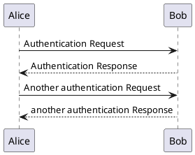
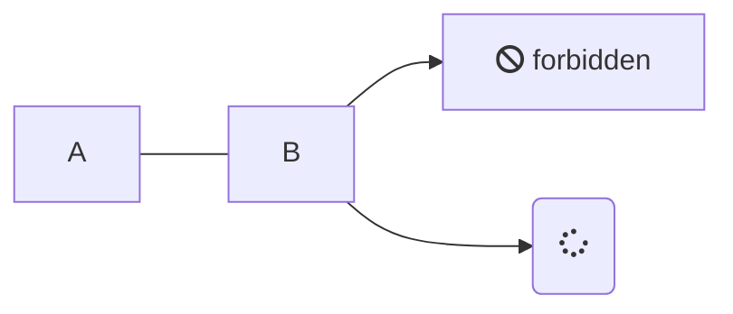

# Before start

## step 1
dedede 

## step 2
```html
<p>Foo</p>
<p>Bar</p>
<p>Baz</p>
```
## step 3
<!-- tabs:start -->

#### **html**

```html
<p>Foo</p>
<p>Bar</p>
<p>Baz</p>
```

#### **Php**

```php
$toto = 2
$toto = 2
$toto = 2
```
`
#### **Js**

```javascript
const a = 1;
const b = 2;
const c = 3;
```

<!-- tabs:end -->
## step 4



## step 5



